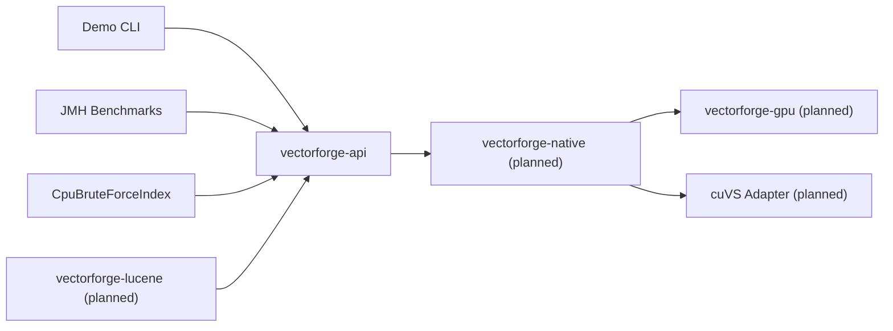

# VectorForge

VectorForge is a Java-first vector search project built to compare exact nearest-neighbor search across a pure JVM baseline, a custom CUDA path, and an NVIDIA cuVS-backed implementation. The repository currently provides a CPU-only baseline with a backend-independent API, deterministic correctness behavior, unit tests, a demo CLI, and a benchmark module scaffold.

## Motivation

The goal is to make JVM, native, and GPU tradeoffs explicit in one repository:

- A correctness-first CPU reference implementation
- A clean Java API that future native and GPU backends can share
- A project layout that stays runnable on machines without CUDA
- A foundation for JNI, CUDA, and cuVS work without blocking early development

## Architecture



## Supported Backends

- `cpu`: implemented and tested
- `cuda`: planned, not yet implemented
- `cuvs`: planned, not yet implemented

## Repository Layout

```text
vectorforge/
├── README.md
├── pom.xml
├── vectorforge-api/
├── vectorforge-cpu/
├── vectorforge-native/
├── vectorforge-gpu/
├── vectorforge-benchmarks/
├── vectorforge-lucene/
├── vectorforge-demo/
├── scripts/
└── docs/
```

## Prerequisites

- Java 21+
- Maven 3.9+
- CUDA toolkit: not required for the default build
- NVIDIA cuVS: not required for the default build

## CPU-Only Setup

```powershell
# from the repository root
./scripts/build-cpu.ps1
```

## CUDA Setup

CUDA compilation and linking are not implemented yet. The `cuda` profile exists so future work can layer in native compilation without changing the top-level build contract.

```powershell
# from the repository root
./scripts/build-cuda.ps1
```

## cuVS Setup

cuVS integration is not implemented yet. The `cuvs` profile is reserved for future native discovery and adapter wiring.

```powershell
# from the repository root
./scripts/build-cuvs.ps1
```

## Build Commands

```powershell
mvn clean verify
mvn test
mvn -pl vectorforge-demo -am package
```

## Demo Commands

Build the demo:

```powershell
mvn -pl vectorforge-demo -am package
```

Run the shaded jar:

```powershell
java -jar vectorforge-demo/target/vectorforge-demo.jar --backend cpu --vectors 100000 --dimensions 384 --queries 100 --k 10
```

Or use the helper script:

```powershell
./scripts/run-demo.ps1
```

## Benchmark Methodology

The detailed benchmark plan lives in [docs/benchmark-methodology.md](docs/benchmark-methodology.md). The repository includes a JMH module scaffold and a CPU search benchmark class, but no published performance claims.

## Current Limitations

- Only the CPU brute-force backend is implemented
- The API supports single-query search; batched search is currently an implementation-specific extension on the CPU backend
- Native, CUDA, and cuVS modules are placeholders to preserve the multi-module build shape
- Benchmark result export and Markdown conversion are deferred until benchmark reporting is implemented

## Roadmap

1. Add the JNI boundary with opaque native handles and explicit memory ownership
2. Add a simple exact CUDA brute-force backend
3. Integrate cuVS behind a narrow native adapter
4. Expand JMH and end-to-end benchmarks with machine-readable output
5. Add Lucene integration after the core backends stabilize
