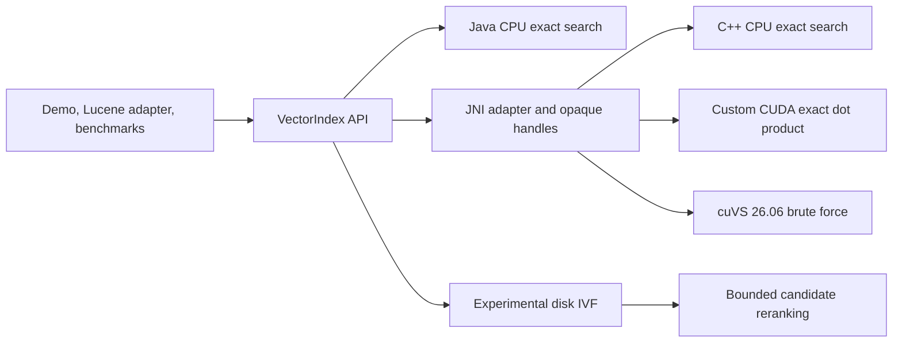

# VectorForge

VectorForge explores a practical systems question: how should a Java application
perform vector similarity search when the data path may span the JVM, native
code, GPU memory, and disk? It implements the same exact-search contract across
a pure Java baseline, JNI/C++, a custom CUDA kernel, and NVIDIA cuVS, then checks
each optional backend against the Java reference.

Java matters because it is common in search and data platforms, but JNI calls,
buffer packing, device transfers, synchronization, and native resource lifetime
can erase the benefit of GPU execution. VectorForge makes those costs visible
while preserving a default build that needs only Java 21 and Maven.

The main finding is not simply that a GPU kernel can be fast. The design keeps
vectors resident and supports query batching, but the measurements also expose
build cost, transfer cost, host-side top-k, JNI materialization, and complete
end-to-end latency. All numbers below are machine-specific observations, not
general performance claims.

## Architecture



The public API owns lifecycle and validation. Java wrappers pack direct buffers
and pass opaque handles through a small JNI surface. Native objects own copied
CPU data or GPU allocations through RAII; Java uses explicit `close()` plus a
last-resort `Cleaner`. CUDA and cuVS are profile-gated, so the CPU-only reactor
does not require CMake, CUDA, cuVS, or NVIDIA hardware.

## Key Engineering Challenges

### Java/native interoperability

JNI uses direct buffers, explicit capacity checks, structured exceptions, and a
native handle registry instead of exposing raw pointers to Java. Read/write
locks prevent rebuild or close from racing an in-flight search, while native
`shared_ptr` snapshots keep objects alive after handle lookup.

### GPU transfer overhead

The custom CUDA backend uploads indexed vectors once and keeps them resident.
Queries and the full score matrix still cross the host/device boundary, and
exact top-k currently runs on the host. Timers therefore report host-to-device,
kernel, device-to-host, native-total, and Java end-to-end time separately.

### Resource ownership

Java wrappers deterministically destroy native handles through
try-with-resources. C++ owns CPU memory, CUDA contexts, modules, events, device
buffers, and cuVS resources through scoped cleanup. A `Cleaner` provides
best-effort recovery for abandoned Java wrappers, but it is not treated as a
replacement for explicit close.

### Correctness validation

The Java brute-force implementation is the oracle. Native, CUDA, and cuVS tests
compare ordered IDs and scores against it using fixed, reproducible inputs. Inputs reject
duplicate IDs, inconsistent dimensions, invalid counts, and non-finite values.
The disk prototype also tests corrupt metadata, missing files, partial writes,
empty partitions, reopening, and concurrent-writer rejection.

### Benchmark design

Index construction is separated from query timing, data generation stays
outside timed sections, GPU calls synchronize before timers stop, and raw
machine-readable samples are retained. JMH covers microbenchmarks; separate
workload runners capture JNI, transfers, synchronization, result conversion,
memory observations, latency percentiles, and Recall@k where applicable.

## Supported Backends

| Capability | Status | Notes |
| --- | --- | --- |
| Java CPU exact search | Complete | Default, hardware-independent correctness baseline |
| Native C++ exact search | Complete, optional | Requires CMake and a C++17 compiler |
| Custom CUDA exact search | Experimental | Requires supported NVIDIA hardware/toolkit; dot product only |
| cuVS brute-force search | Experimental | Verified with cuVS 26.06 on Linux/WSL2 |
| Lucene adapter | Experimental | Standalone adapter; no Lucene-internal integration |
| Disk-backed IVF | Experimental | Immutable research prototype, not a database engine |

## Repository Layout

```text
vectorforge/
├── README.md
├── pom.xml
├── vectorforge-api/
├── vectorforge-cpu/
├── vectorforge-native/
├── vectorforge-gpu/
├── vectorforge-benchmarks/
├── vectorforge-lucene/
├── vectorforge-disk/
├── vectorforge-demo/
├── benchmark-results/
├── scripts/
└── docs/
```

## Prerequisites

- Java 21+
- Maven 3.9+
- CUDA toolkit: not required for the default build
- NVIDIA cuVS: not required for the default build

## CPU-Only Setup

```powershell
cd vectorforge
./scripts/build-cpu.ps1
```

## Native Setup

The JNI backend is profile-gated. The default build remains CPU-only and does not require CMake or a C++ compiler. To build and test the native backend:

```powershell
cd vectorforge
./scripts/build-native.ps1
```

## CUDA Setup

The CUDA backend is optional behind the existing `cuda` profile. The default build still works without CUDA. The CUDA profile currently targets:

- NVIDIA CUDA toolkit 12.x headers and NVRTC
- An NVIDIA driver with a usable CUDA device
- A C++17 build selected by CMake's platform default generator, or by the
  standard `CMAKE_GENERATOR` environment variable

Build and test the CUDA backend with:

```powershell
cd vectorforge
./scripts/build-cuda.ps1
```

## cuVS Setup

The verified cuVS path is Linux/WSL2 with cuVS 26.06, CUDA 12.x, CMake 3.30.4 or newer, Ninja, a C++17 compiler, and DLPack headers. The default build does not require any of these cuVS dependencies.

The local reference environment uses a Miniforge environment named `cuvs`. Make the environment prefix visible to CMake and the runtime linker:

```bash
conda activate cuvs
export CMAKE_GENERATOR=Ninja
export CMAKE_PREFIX_PATH="$CONDA_PREFIX${CMAKE_PREFIX_PATH:+:$CMAKE_PREFIX_PATH}"
export CUDAToolkit_ROOT="$CONDA_PREFIX/targets/x86_64-linux"
export LD_LIBRARY_PATH="$CONDA_PREFIX/lib${LD_LIBRARY_PATH:+:$LD_LIBRARY_PATH}"
mvn clean verify -Pcuvs
```

`CMAKE_GENERATOR` is optional when CMake's platform default generator is
installed. The profile resolves the installed `cuvs::c_api` CMake target and
links `libcuvs_c.so`. See [docs/cuvs-integration-plan.md](docs/cuvs-integration-plan.md) for the exact verified API surface and supported behavior.

## Build Commands

```powershell
mvn clean verify
mvn test
mvn clean verify -Pnative
mvn clean verify -Pcuda
mvn clean verify -Pcuvs
mvn -pl vectorforge-demo -am package
```

## Demo Commands

Build the demo:

```powershell
mvn -pl vectorforge-demo -am package
```

Run the shaded jar:

```powershell
java -jar vectorforge-demo/target/vectorforge-demo.jar --backend cpu --vectors 100000 --dimensions 384 --queries 100 --k 10
java -Dvectorforge.native.library.dir=vectorforge-native/target/native-lib -jar vectorforge-demo/target/vectorforge-demo.jar --backend native --vectors 100000 --dimensions 384 --queries 100 --k 10
java -Dvectorforge.native.library.dir=vectorforge-native/target/native-lib -jar vectorforge-demo/target/vectorforge-demo.jar --backend cuda --vectors 100000 --dimensions 384 --queries 100 --k 10 --metric dot_product
java -Dvectorforge.native.library.dir=vectorforge-native/target/native-lib -jar vectorforge-demo/target/vectorforge-demo.jar --backend cuvs --vectors 10000 --dimensions 128 --queries 16 --k 10 --metric dot_product
```

Or use the helper script:

```powershell
./scripts/run-demo.ps1
```

The standalone Lucene integration is documented in
[`docs/lucene-integration.md`](docs/lucene-integration.md). Its CPU-only demo uses Lucene public
APIs, rebuilds VectorForge from live documents at an explicit refresh boundary, and compares
VectorForge results with Lucene's built-in vector search.

The experimental disk-backed IVF path is documented in
[`docs/disk-ivf-prototype.md`](docs/disk-ivf-prototype.md). It stores immutable partition
generations on disk, probes selected posting lists, and reranks every selected candidate with an
existing VectorForge backend in byte-bounded batches.

## Benchmark Methodology

The detailed benchmark plan and current verified results live in [docs/benchmark-methodology.md](docs/benchmark-methodology.md).

The CUDA backend design and timing model are documented in [docs/cuda-backend.md](docs/cuda-backend.md).

For reproducible end-to-end CPU/custom-CUDA/cuVS runs with JSON Lines output, presets, system metadata, recall, memory snapshots, raw latency samples, and generated Markdown tables, see [docs/end-to-end-benchmarks.md](docs/end-to-end-benchmarks.md).

## Results

The following comparison is from one actual WSL2 run on an Intel Core
i7-11800H. It used OpenJDK 21.0.10, CUDA 12.9, cuVS 26.6.0, 10 warm-up
iterations, 20 measured iterations, and fixed seed `20260728`. Every backend
searched the same 10,000-vector, 128-dimensional dataset with batch size 1,
`k=10`, and dot product.

| Backend | Build ms | Batch avg ms | p50 ms | p95 ms | p99 ms | QPS | Recall@10 |
| --- | ---: | ---: | ---: | ---: | ---: | ---: | ---: |
| Java CPU | 6.922 | 1.105 | 1.031 | 1.371 | 1.402 | 904.880 | 1.000000 |
| Native C++ CPU | 17.403 | 0.841 | 0.817 | 1.056 | 1.097 | 1188.720 | 1.000000 |
| Custom CUDA | 1004.236 | 0.267 | 0.228 | 0.413 | 0.454 | 3745.840 | 1.000000 |
| cuVS | 126.380 | 0.436 | 0.410 | 0.582 | 0.695 | 2292.468 | 1.000000 |

For the custom CUDA backend, average measured phases were 0.012 ms host to
device, 0.042 ms kernel, and 0.077 ms device to host. The other backends do not
expose comparable phase timing through this harness.

These are local smoke-workload observations, not general performance claims.
Backends ran sequentially in one JVM and percentile values are order statistics
from 20 samples. Build time was measured separately from queries; QPS comes
from summed end-to-end batch time; Recall@k is ID-set overlap against the Java
CPU ground truth. See the checked-in
[JSON Lines artifact](benchmark-results/wsl2-intel-comparison.jsonl),
[generated summary](benchmark-results/wsl2-intel-comparison.md), and
[benchmark methodology](docs/benchmark-methodology.md) for raw samples,
environment details, and limitations.

### Batch and dataset scaling

A second run on the same WSL2 Intel machine varied dataset size and batch size
while keeping 128 dimensions, `k=10`, dot product, and seed `20260728` fixed.
It used 5 warm-up iterations and 20 measured iterations per scenario. The table
reports end-to-end queries per second; higher is better.

| Vectors | Batch | Java CPU | Native C++ CPU | Custom CUDA | cuVS |
| ---: | ---: | ---: | ---: | ---: | ---: |
| 10,000 | 1 | 830.7 | 1,225.3 | 5,851.0 | 2,091.8 |
| 10,000 | 8 | 1,139.1 | 1,307.6 | 16,999.5 | 25,198.3 |
| 10,000 | 32 | 1,237.8 | 1,322.4 | 19,170.6 | 73,738.7 |
| 10,000 | 128 | 1,247.7 | 1,348.5 | 21,987.0 | 102,012.9 |
| 100,000 | 1 | 115.0 | 122.8 | 1,887.4 | 2,787.9 |
| 100,000 | 8 | 116.8 | 124.8 | 2,256.8 | 8,082.3 |
| 100,000 | 32 | 116.5 | 123.7 | 2,414.9 | 19,903.6 |
| 100,000 | 128 | 117.2 | 123.7 | 2,529.6 | 41,370.5 |

cuVS did not lead the original 10,000-vector, batch-one comparison, but it
overtook custom CUDA at batches 8, 32, and 128. With 100,000 vectors, cuVS led
at every tested batch size. This shows why a single small query is insufficient
for ranking GPU backends: cuVS benefits much more strongly from batching, while
the current custom CUDA path scales less efficiently across a query batch.

All 32 backend/scenario combinations completed without skips or errors and
matched the exact Java baseline at Recall@10 = 1.0. These remain single-run
local observations. Scenarios executed sequentially in one JVM, backend order
was fixed, and batch latency is not per-query latency. The complete
[scaling JSON Lines artifact](benchmark-results/wsl2-intel-scaling.jsonl) and
[generated scaling summary](benchmark-results/wsl2-intel-scaling.md) retain
the latency percentiles, build times, memory observations, CUDA phase timings,
and raw samples.

## Current Limitations

- The shared API supports scalar and batch search, but optimized batching remains backend-specific
- The JNI backend currently packs Java arrays into direct buffers per call instead of reusing long-lived off-heap query buffers
- The CUDA backend currently supports dot-product search only
- The cuVS build is currently verified only with cuVS 26.06 on Linux/WSL2; Windows-native cuVS packaging is not provided
- The cuVS adapter uses exact brute-force search and builds one metric-bound cuVS index for each VectorForge metric, increasing device-memory use
- The CUDA implementation computes the full query-by-vector score matrix on the GPU and performs exact top-k selection on the host, which is correct but not performance-optimal
- `BackendComparisonRunner` is a small end-to-end smoke profiler, not a substitute for JMH or a controlled cross-machine benchmark

## What I Learned

- **There is no universally best backend.** Java CPU has the lowest dependency
  and deployment cost and built the 10,000-vector index in 6.9 ms, so it is a
  sensible default for CPU-only environments, small collections, and short-lived
  indexes where GPU startup cannot be amortized. Native C++ produced a modest
  throughput improvement at 10,000 vectors, but at 100,000 vectors its measured
  batch-one throughput was roughly equal to Java. JNI alone does not guarantee
  a useful speedup.
- **Custom CUDA is strongest for small, latency-sensitive dot-product queries in
  the tested configuration.** At 10,000 vectors and batch size 1 it delivered
  5,851.0 QPS versus cuVS at 2,091.8 QPS. That specialization has costs: the
  custom backend supports only dot product, its first measured build was much
  slower, and its current batch path scales less efficiently than cuVS.
- **cuVS is the better measured choice as batch size or dataset size grows.** It
  overtook custom CUDA at 10,000 vectors for batches 8, 32, and 128, and led at
  every tested batch size with 100,000 vectors. At 100,000 vectors and batch 128,
  cuVS reached 41,370.5 QPS versus 2,529.6 for custom CUDA. This supports batching
  requests before GPU search when the application can tolerate the queueing
  tradeoff; it is not proof that cuVS wins on every machine or workload.
- **End-to-end timing changes the story.** In the original custom-CUDA batch-one
  run, the reported H2D, kernel, and D2H phases totaled about 0.131 ms, while the
  Java-visible operation took 0.267 ms. The remaining 0.136 ms, about 51%,
  included Java packing, JNI orchestration, host-side exact top-k,
  synchronization and timing overhead, and result conversion. The harness does
  not isolate those costs individually, so kernel timing alone would overstate
  application performance.
- **Correctness has to accompany speed.** All 32 scaling combinations achieved
  Recall@10 of 1.0 against the Java exact-search baseline. Fixed seeds, identical
  inputs, warm-up, synchronization, and raw samples made performance comparisons
  useful without weakening validation.
- **Native performance is also an ownership problem.** Exception-safe
  construction, exactly-once destruction, concurrent close behavior, and loader
  diagnostics were as important as the search loop. Optional GPU dependencies
  also had to remain optional throughout modules, builds, tests, documentation,
  and CI rather than only behind a runtime flag.
- **Unsuccessful optimizations are useful evidence.** Reusing Java-side direct
  buffers was reverted because the recorded measurements did not show a stable
  improvement. Keeping the simpler implementation was preferable to retaining
  complexity supported only by an assumption.

## Limitations and Future Work

- Move custom-CUDA top-k selection onto the device and avoid copying the full
  score matrix to the host.
- Add production-grade approximate in-memory indexes; the current cuVS path is
  exact brute force and disk IVF remains a research prototype.
- Run publishable comparisons in isolated JVMs with rotated backend order,
  additional forks, confidence intervals, and controlled power/thermal state.
- Provision the documented self-hosted NVIDIA CI runner. Hosted CI currently
  verifies default and native builds, while real GPU execution is manual.
- Improve packaging for versioned cuVS/CUDA runtime dependencies without
  pretending the current Linux/WSL2 environment is portable to native Windows.
- Extend Lucene integration beyond explicit full rebuilds only after the public
  adapter behavior is stable; no deep segment or merge integration exists.
- Treat disk locking as advisory. Distributed coordination, replication,
  compaction, and database-grade crash consistency are not implemented.
