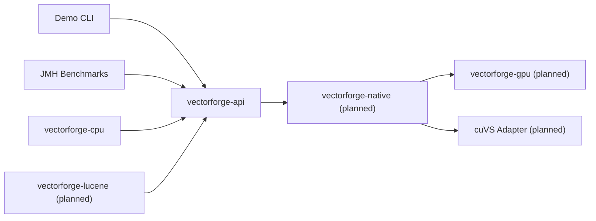

# VectorForge

VectorForge is a Java-first vector search project built to compare exact nearest-neighbor search across a pure JVM baseline, a future custom CUDA path, and a future NVIDIA cuVS-backed implementation. Today the repository provides a CPU-only baseline with a backend-independent API, deterministic correctness behavior, unit tests, a demo CLI, and a JMH benchmark harness.

## Current Status

- `cpu`: implemented, tested, and benchmarked
- `cuda`: planned, not yet implemented
- `cuvs`: planned, not yet implemented

The current CPU backend is the correctness reference for all future native and GPU work.

## Motivation

The repository is structured to make JVM, native, and GPU tradeoffs explicit:

- A correctness-first CPU reference implementation
- A stable Java API that future native and GPU backends can share
- A build layout that remains usable on machines without CUDA
- Reserved extension points for JNI, CUDA, and cuVS without blocking CPU-only development

## Architecture



The hot path for the implemented baseline is:

1. The caller selects `--backend cpu` in the demo or directly constructs the CPU index.
2. `vectorforge-api` validates the metric and search parameters.
3. `CpuBruteForceIndex` flattens vectors into contiguous heap arrays, precomputes cosine norms, and publishes immutable state.
4. Each query scans all indexed vectors, keeps only the best `k` scores in a bounded heap, and returns deterministic results ordered by score and ID.

More detail lives in [docs/architecture.md](docs/architecture.md) and [docs/native-memory-model.md](docs/native-memory-model.md).

## Repository Layout

```text
vectorforge/
├── README.md
├── pom.xml
├── vectorforge-api/
├── vectorforge-cpu/
├── vectorforge-native/
├── vectorforge-gpu/
├── vectorforge-benchmarks/
├── vectorforge-lucene/
├── vectorforge-demo/
├── scripts/
└── docs/
```

## Prerequisites

- Java 21+
- Maven 3.9+
- CUDA toolkit: not required for the default build
- NVIDIA cuVS: not required for the default build

## Build and Test

CPU-only development requires no native toolchain:

```powershell
./scripts/build-cpu.ps1
mvn clean verify
mvn test
```

The repository also reserves future build entry points:

```powershell
./scripts/build-cuda.ps1
./scripts/build-cuvs.ps1
```

`build-cuda.ps1` and `build-cuvs.ps1` are placeholders today because the `cuda` and `cuvs` backends are not implemented yet.

## Usage Examples

Build the shaded demo jar:

```powershell
mvn -pl vectorforge-demo -am package
```

Run the verified CPU demo scenario:

```powershell
java -jar vectorforge-demo/target/vectorforge-demo.jar --backend cpu --vectors 100000 --dimensions 384 --queries 100 --k 10 --metric cosine
```

Verified output summary from the July 21, 2026 reference run:

- `build_ms=83.728`
- `search_ms=2908.539`
- `avg_query_us=29085.390`

Or use the helper script:

```powershell
./scripts/run-demo.ps1
```

## Benchmark Methodology and Verified Results

The benchmark process and environment details live in [docs/benchmark-methodology.md](docs/benchmark-methodology.md). The current verified CPU baseline was collected on July 21, 2026 with JMH:

| Benchmark | Params | Result |
| --- | --- | --- |
| `CpuBruteForceSearchBenchmark.searchTopK` | `dimensions=128`, `k=10`, `vectorCount=10000` | `894.760 +- 36.378 us/op` |

Reference command:

```powershell
java -jar vectorforge-benchmarks/target/vectorforge-benchmarks.jar com.vectorforge.benchmarks.CpuBruteForceSearchBenchmark.searchTopK -wi 3 -i 5 -f 1
```

## Limitations

- Only the CPU brute-force backend is implemented.
- Search complexity is exact brute force; latency grows linearly with `vectorCount`.
- The API standardizes single-query search; batched search is currently an implementation-specific CPU extension.
- Native, CUDA, and cuVS modules are placeholders kept to preserve the multi-module build shape.
- There is no verified GPU benchmark or cuVS validation yet because those backends do not exist in the current codebase.

## Skipped Validation

- GPU backend benchmarks were skipped because the `cuda` backend is not implemented.
- cuVS validation was skipped because the `cuvs` backend is not implemented.

## Roadmap

1. Add the JNI boundary with opaque native handles and explicit memory ownership.
2. Add a simple exact CUDA brute-force backend.
3. Integrate cuVS behind a narrow native adapter.
4. Expand JMH and end-to-end benchmark reporting.
5. Add Lucene integration after the core backends stabilize.
