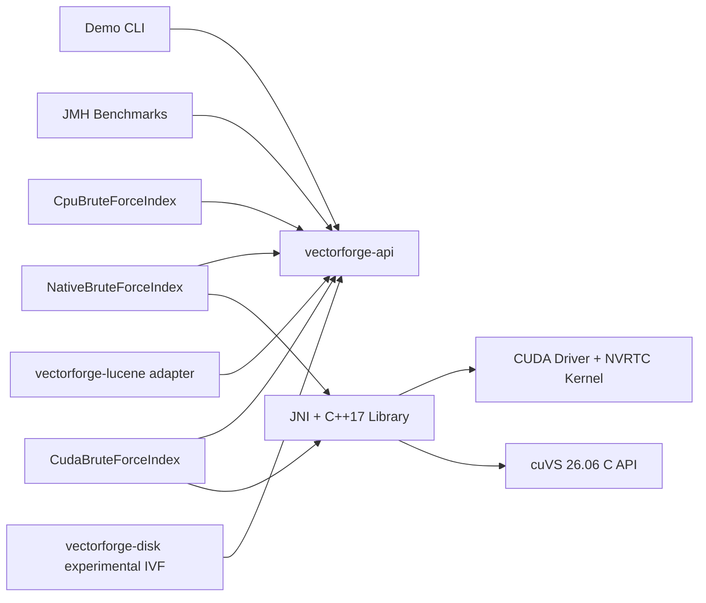

# VectorForge

VectorForge is a Java-first vector search project built to compare exact nearest-neighbor search across a pure JVM baseline, a custom CUDA path, and an NVIDIA cuVS-backed implementation. The repository provides a CPU baseline, a JNI-backed native reference backend, an educational exact CUDA backend, and an optional exact cuVS brute-force backend.

## Motivation

The goal is to make JVM, native, and GPU tradeoffs explicit in one repository:

- A correctness-first CPU reference implementation
- A JNI/native backend that validates handle safety and memory ownership
- An exact CUDA backend that keeps vectors resident on the GPU
- A clean Java API that future native and GPU backends can share
- A project layout that stays runnable on machines without CUDA
- A foundation for JNI, CUDA, and cuVS work without blocking early development

## Architecture



## Supported Backends

- `cpu`: implemented and tested
- `native`: implemented and tested through JNI and a C++17 shared library
- `cuda`: implemented and tested as an exact dot-product backend
- `cuvs`: implemented as an optional exact brute-force backend using the verified cuVS 26.06 C API

## Repository Layout

```text
vectorforge/
├── README.md
├── pom.xml
├── vectorforge-api/
├── vectorforge-cpu/
├── vectorforge-native/
├── vectorforge-gpu/
├── vectorforge-benchmarks/
├── vectorforge-lucene/
├── vectorforge-demo/
├── scripts/
└── docs/
```

## Prerequisites

- Java 21+
- Maven 3.9+
- CUDA toolkit: not required for the default build
- NVIDIA cuVS: not required for the default build

## CPU-Only Setup

```powershell
cd vectorforge
./scripts/build-cpu.ps1
```

## Native Setup

The JNI backend is profile-gated. The default build remains CPU-only and does not require CMake or a C++ compiler. To build and test the native backend:

```powershell
cd vectorforge
./scripts/build-native.ps1
```

## CUDA Setup

The CUDA backend is optional behind the existing `cuda` profile. The default build still works without CUDA. The CUDA profile currently targets:

- NVIDIA CUDA toolkit 12.x headers and NVRTC
- An NVIDIA driver with a usable CUDA device
- The existing MinGW-based native build through runtime-loaded CUDA APIs

Build and test the CUDA backend with:

```powershell
cd vectorforge
./scripts/build-cuda.ps1
```

## cuVS Setup

The verified cuVS path is Linux/WSL2 with cuVS 26.06, CUDA 12.x, CMake 3.30.4 or newer, Ninja, a C++17 compiler, and DLPack headers. The default build does not require any of these cuVS dependencies.

The local reference environment uses a Miniforge environment named `cuvs`. Make the environment prefix visible to CMake and the runtime linker:

```bash
conda activate cuvs
export CMAKE_PREFIX_PATH="$CONDA_PREFIX${CMAKE_PREFIX_PATH:+:$CMAKE_PREFIX_PATH}"
export CUDAToolkit_ROOT="$CONDA_PREFIX/targets/x86_64-linux"
export LD_LIBRARY_PATH="$CONDA_PREFIX/lib${LD_LIBRARY_PATH:+:$LD_LIBRARY_PATH}"
mvn clean verify -Pcuvs
```

The profile resolves the installed `cuvs::c_api` CMake target and links `libcuvs_c.so`. See [docs/cuvs-integration-plan.md](docs/cuvs-integration-plan.md) for the exact verified API surface and supported behavior.

## Build Commands

```powershell
mvn clean verify
mvn test
mvn clean verify -Pnative
mvn clean verify -Pcuda
mvn clean verify -Pcuvs
mvn -pl vectorforge-demo -am package
```

## Demo Commands

Build the demo:

```powershell
mvn -pl vectorforge-demo -am package
```

Run the shaded jar:

```powershell
java -jar vectorforge-demo/target/vectorforge-demo.jar --backend cpu --vectors 100000 --dimensions 384 --queries 100 --k 10
java -Dvectorforge.native.library.dir=vectorforge-native/target/native-lib -jar vectorforge-demo/target/vectorforge-demo.jar --backend native --vectors 100000 --dimensions 384 --queries 100 --k 10
java -Dvectorforge.native.library.dir=vectorforge-native/target/native-lib -jar vectorforge-demo/target/vectorforge-demo.jar --backend cuda --vectors 100000 --dimensions 384 --queries 100 --k 10 --metric dot_product
java -Dvectorforge.native.library.dir=vectorforge-native/target/native-lib -jar vectorforge-demo/target/vectorforge-demo.jar --backend cuvs --vectors 10000 --dimensions 128 --queries 16 --k 10 --metric dot_product
```

Or use the helper script:

```powershell
./scripts/run-demo.ps1
```

The standalone Lucene integration is documented in
[`docs/lucene-integration.md`](docs/lucene-integration.md). Its CPU-only demo uses Lucene public
APIs, rebuilds VectorForge from live documents at an explicit refresh boundary, and compares
VectorForge results with Lucene's built-in vector search.

The experimental disk-backed IVF path is documented in
[`docs/disk-ivf-prototype.md`](docs/disk-ivf-prototype.md). It stores immutable partition
generations on disk, probes selected posting lists, and reranks every selected candidate with an
existing VectorForge backend in byte-bounded batches.

## Benchmark Methodology

The detailed benchmark plan and current verified results live in [docs/benchmark-methodology.md](docs/benchmark-methodology.md).

The CUDA backend design and timing model are documented in [docs/cuda-backend.md](docs/cuda-backend.md).

For reproducible end-to-end CPU/custom-CUDA/cuVS runs with JSON Lines output, presets, system metadata, recall, memory snapshots, raw latency samples, and generated Markdown tables, see [docs/end-to-end-benchmarks.md](docs/end-to-end-benchmarks.md).

## Verified Results

These commands were re-run successfully in the current review pass:

- `mvn clean verify`
- `mvn clean verify -Pcuda`

Available JMH benchmark:

- `CpuBruteForceSearchBenchmark.searchTopK`

Observed CPU JMH result:

| Benchmark | Params | Result |
| --- | --- | --- |
| `CpuBruteForceSearchBenchmark.searchTopK` | `dimensions=128`, `k=10`, `vectorCount=10000` | `930.850 +- 10.293 us/op` |

Reference command:

```powershell
java -jar vectorforge-benchmarks/target/vectorforge-benchmarks.jar com.vectorforge.benchmarks.CpuBruteForceSearchBenchmark.searchTopK -wi 3 -i 5 -f 1
```

Verified CUDA profile harness commands:

```powershell
java -Dvectorforge.native.library.dir=vectorforge-native/target/native-lib -cp vectorforge-benchmarks/target/vectorforge-benchmarks.jar com.vectorforge.benchmarks.CudaBackendProfileRunner --vectors 10000 --dimensions 128 --k 10 --warmup 30 --iterations 120 --small-queries 1 --batch-queries 32
java -Dvectorforge.native.library.dir=vectorforge-native/target/native-lib -cp vectorforge-benchmarks/target/vectorforge-benchmarks.jar com.vectorforge.benchmarks.CudaBackendProfileRunner --vectors 50000 --dimensions 384 --k 10 --warmup 10 --iterations 20 --small-queries 1 --batch-queries 16
```

Representative current CUDA profile results:

| Dataset | Path | Scenario | End-to-end avg | Kernel avg | Native total avg |
| --- | --- | --- | --- | --- | --- |
| `10000 x 128` | `high_level` | `single` | `191.667 us` | `0.018 ms` | `0.153 ms` |
| `10000 x 128` | `high_level` | `batch x32` | `1050.008 us` | `0.109 ms` | `0.958 ms` |
| `50000 x 384` | `high_level` | `single` | `504.095 us` | `0.202 ms` | `0.438 ms` |
| `50000 x 384` | `high_level` | `batch x16` | `6516.940 us` | `4.788 ms` | `6.343 ms` |

Verified end-to-end demo scenario:

```powershell
java -jar vectorforge-demo/target/vectorforge-demo.jar --backend cpu --vectors 100000 --dimensions 384 --queries 100 --k 10 --metric dot_product
java -Dvectorforge.native.library.dir=vectorforge-native/target/native-lib -jar vectorforge-demo/target/vectorforge-demo.jar --backend native --vectors 100000 --dimensions 384 --queries 100 --k 10 --metric dot_product
java -Dvectorforge.native.library.dir=vectorforge-native/target/native-lib -jar vectorforge-demo/target/vectorforge-demo.jar --backend cuda --vectors 100000 --dimensions 384 --queries 100 --k 10 --metric dot_product
```

Observed results:

| Backend | `build_ms` | `search_ms` | `avg_query_us` |
| --- | --- | --- | --- |
| `cpu` | `88.015` | `3043.580` | `30435.804` |
| `native` | `154.011` | `2930.033` | `29300.326` |
| `cuda` | `477.857` | `101.818` | `1018.183` |

Observed CUDA phase timings for that run:

| Metric | Value |
| --- | --- |
| `cuda_h2d_ms` | `0.052` |
| `cuda_kernel_ms` | `76.459` |
| `cuda_d2h_ms` | `6.267` |
| `cuda_total_ms` | `98.155` |

## Current Limitations

- The shared `VectorIndex` API still exposes only single-query search; batched search is currently an implementation-specific extension on the CPU and native backends
- The JNI backend currently packs Java arrays into direct buffers per call instead of reusing long-lived off-heap query buffers
- The CUDA backend currently supports dot-product search only
- The cuVS build is currently verified only with cuVS 26.06 on Linux/WSL2; Windows-native cuVS packaging is not provided
- The cuVS adapter uses exact brute-force search and builds one metric-bound cuVS index for each VectorForge metric, increasing device-memory use
- The CUDA implementation computes the full query-by-vector score matrix on the GPU and performs exact top-k selection on the host, which is correct but not performance-optimal
- `BackendComparisonRunner` is a small end-to-end smoke profiler, not a substitute for JMH or a controlled cross-machine benchmark

## Roadmap

1. Expand JMH and end-to-end benchmarks with machine-readable output
2. Reduce cuVS query-time allocation and transfer overhead where measurements justify it
3. Add Lucene integration after the core backends stabilize
