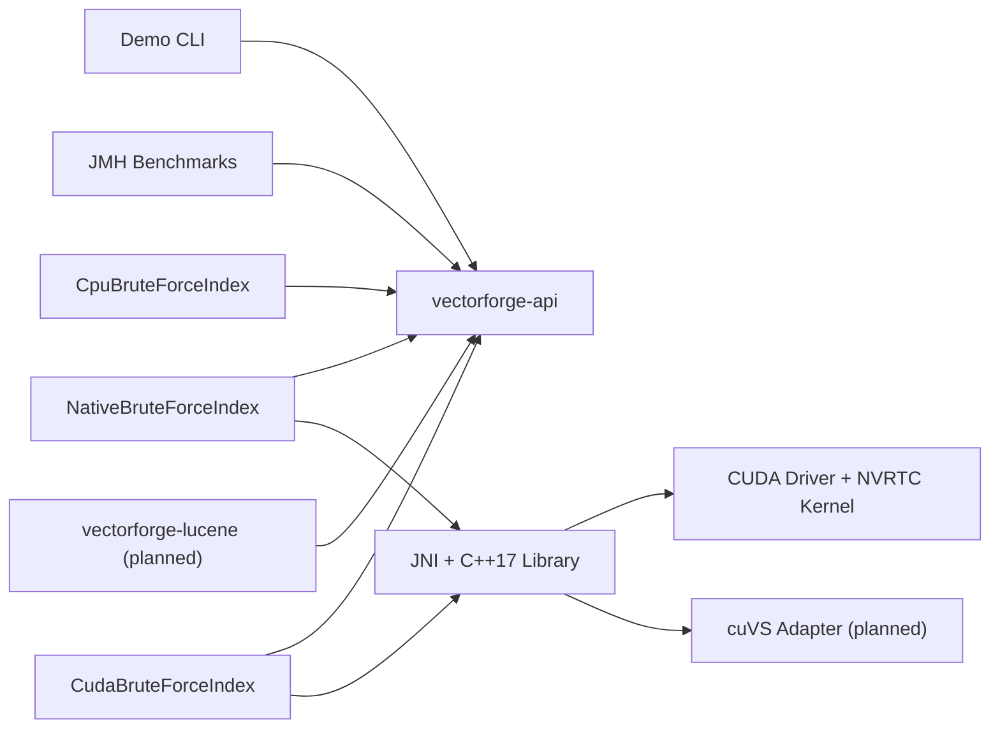

# VectorForge

VectorForge is a Java-first vector search project built to compare exact nearest-neighbor search across a pure JVM baseline, a custom CUDA path, and an NVIDIA cuVS-backed implementation. The current repository provides a CPU baseline, a JNI-backed native reference backend, and an educational exact CUDA backend.

## Motivation

The goal is to make JVM, native, and GPU tradeoffs explicit in one repository:

- A correctness-first CPU reference implementation
- A JNI/native backend that validates handle safety and memory ownership
- An exact CUDA backend that keeps vectors resident on the GPU
- A clean Java API that future native and GPU backends can share
- A project layout that stays runnable on machines without CUDA
- A foundation for JNI, CUDA, and cuVS work without blocking early development

## Architecture



## Supported Backends

- `cpu`: implemented and tested
- `native`: implemented and tested through JNI and a C++17 shared library
- `cuda`: implemented and tested as an exact dot-product backend
- `cuvs`: planned, not implemented yet

## Repository Layout

```text
vectorforge/
├── README.md
├── pom.xml
├── vectorforge-api/
├── vectorforge-cpu/
├── vectorforge-native/
├── vectorforge-gpu/
├── vectorforge-benchmarks/
├── vectorforge-lucene/
├── vectorforge-demo/
├── scripts/
└── docs/
```

## Prerequisites

- Java 21+
- Maven 3.9+
- CUDA toolkit: not required for the default build
- NVIDIA cuVS: not required for the default build

## CPU-Only Setup

```powershell
cd vectorforge
./scripts/build-cpu.ps1
```

## Native Setup

The JNI backend is profile-gated. The default build remains CPU-only and does not require CMake or a C++ compiler. To build and test the native backend:

```powershell
cd vectorforge
./scripts/build-native.ps1
```

## CUDA Setup

The CUDA backend is optional behind the existing `cuda` profile. The default build still works without CUDA. The CUDA profile currently targets:

- NVIDIA CUDA toolkit 12.x headers and NVRTC
- An NVIDIA driver with a usable CUDA device
- The existing MinGW-based native build through runtime-loaded CUDA APIs

Build and test the CUDA backend with:

```powershell
cd vectorforge
./scripts/build-cuda.ps1
```

## cuVS Setup

cuVS is not integrated yet. The `cuvs` profile is reserved for future native discovery and adapter wiring.

```powershell
cd vectorforge
./scripts/build-cuvs.ps1
```

## Build Commands

```powershell
mvn clean verify
mvn test
mvn clean verify -Pnative
mvn clean verify -Pcuda
mvn -pl vectorforge-demo -am package
```

## Demo Commands

Build the demo:

```powershell
mvn -pl vectorforge-demo -am package
```

Run the shaded jar:

```powershell
java -jar vectorforge-demo/target/vectorforge-demo.jar --backend cpu --vectors 100000 --dimensions 384 --queries 100 --k 10
java -Dvectorforge.native.library.dir=vectorforge-native/target/native-lib -jar vectorforge-demo/target/vectorforge-demo.jar --backend native --vectors 100000 --dimensions 384 --queries 100 --k 10
java -Dvectorforge.native.library.dir=vectorforge-native/target/native-lib -jar vectorforge-demo/target/vectorforge-demo.jar --backend cuda --vectors 100000 --dimensions 384 --queries 100 --k 10 --metric dot_product
```

Or use the helper script:

```powershell
./scripts/run-demo.ps1
```

## Benchmark Methodology

The detailed benchmark plan and current verified results live in [docs/benchmark-methodology.md](docs/benchmark-methodology.md).

The CUDA backend design and timing model are documented in [docs/cuda-backend.md](docs/cuda-backend.md).

## Verified Results

These commands were re-run successfully in the current review pass:

- `mvn clean verify`
- `mvn clean verify -Pcuda`

Available JMH benchmark:

- `CpuBruteForceSearchBenchmark.searchTopK`

Observed CPU JMH result:

| Benchmark | Params | Result |
| --- | --- | --- |
| `CpuBruteForceSearchBenchmark.searchTopK` | `dimensions=128`, `k=10`, `vectorCount=10000` | `953.574 +- 32.782 us/op` |

Reference command:

```powershell
java -jar vectorforge-benchmarks/target/vectorforge-benchmarks.jar com.vectorforge.benchmarks.CpuBruteForceSearchBenchmark.searchTopK -wi 3 -i 5 -f 1
```

Verified end-to-end demo scenario:

```powershell
java -jar vectorforge-demo/target/vectorforge-demo.jar --backend cpu --vectors 100000 --dimensions 384 --queries 100 --k 10 --metric dot_product
java -Dvectorforge.native.library.dir=vectorforge-native/target/native-lib -jar vectorforge-demo/target/vectorforge-demo.jar --backend native --vectors 100000 --dimensions 384 --queries 100 --k 10 --metric dot_product
java -Dvectorforge.native.library.dir=vectorforge-native/target/native-lib -jar vectorforge-demo/target/vectorforge-demo.jar --backend cuda --vectors 100000 --dimensions 384 --queries 100 --k 10 --metric dot_product
```

Observed results:

| Backend | `build_ms` | `search_ms` | `avg_query_us` |
| --- | --- | --- | --- |
| `cpu` | `86.855` | `2963.671` | `29636.713` |
| `native` | `119.914` | `2793.152` | `27931.515` |
| `cuda` | `305.865` | `438.178` | `4381.775` |

Observed CUDA phase timings for that run:

| Metric | Value |
| --- | --- |
| `cuda_h2d_ms` | `0.042` |
| `cuda_kernel_ms` | `414.848` |
| `cuda_d2h_ms` | `5.493` |
| `cuda_total_ms` | `434.427` |

## Current Limitations

- The shared `VectorIndex` API still exposes only single-query search; batched search is currently an implementation-specific extension on the CPU and native backends
- The JNI backend currently packs Java arrays into direct buffers per call instead of reusing long-lived off-heap query buffers
- The CUDA backend currently supports dot-product search only
- The CUDA implementation computes the full query-by-vector score matrix on the GPU and performs exact top-k selection on the host, which is correct but not performance-optimal
- The benchmark module currently contains only a CPU JMH benchmark; native and CUDA timing is verified through the demo path rather than a dedicated JMH harness

## Roadmap

1. Integrate cuVS behind a narrow native adapter
2. Expand JMH and end-to-end benchmarks with machine-readable output
3. Add Lucene integration after the core backends stabilize
