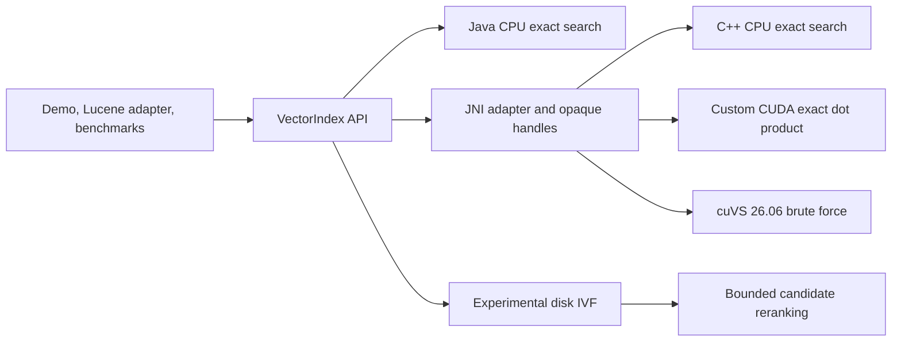

# VectorForge

VectorForge explores a practical systems question: how should a Java application
perform vector similarity search when the data path may span the JVM, native
code, GPU memory, and disk? It implements the same exact-search contract across
a pure Java baseline, JNI/C++, a custom CUDA kernel, and NVIDIA cuVS, then checks
each optional backend against the Java reference.

Java matters because it is common in search and data platforms, but JNI calls,
buffer packing, device transfers, synchronization, and native resource lifetime
can erase the benefit of GPU execution. VectorForge makes those costs visible
while preserving a default build that needs only Java 21 and Maven.

The main finding is not simply that a GPU kernel can be fast. The design keeps
vectors resident and supports query batching, but the measurements also expose
build cost, transfer cost, host-side top-k, JNI materialization, and complete
end-to-end latency. All numbers below are machine-specific observations, not
general performance claims.

## Architecture



The public API owns lifecycle and validation. Java wrappers pack direct buffers
and pass opaque handles through a small JNI surface. Native objects own copied
CPU data or GPU allocations through RAII; Java uses explicit `close()` plus a
last-resort `Cleaner`. CUDA and cuVS are profile-gated, so the CPU-only reactor
does not require CMake, CUDA, cuVS, or NVIDIA hardware.

## Key Engineering Challenges

### Java/native interoperability

JNI uses direct buffers, explicit capacity checks, structured exceptions, and a
native handle registry instead of exposing raw pointers to Java. Read/write
locks prevent rebuild or close from racing an in-flight search, while native
`shared_ptr` snapshots keep objects alive after handle lookup.

### GPU transfer overhead

The custom CUDA backend uploads indexed vectors once and keeps them resident.
Queries and the full score matrix still cross the host/device boundary, and
exact top-k currently runs on the host. Timers therefore report host-to-device,
kernel, device-to-host, native-total, and Java end-to-end time separately.

### Resource ownership

Java wrappers deterministically destroy native handles through
try-with-resources. C++ owns CPU memory, CUDA contexts, modules, events, device
buffers, and cuVS resources through scoped cleanup. A `Cleaner` provides
best-effort recovery for abandoned Java wrappers, but it is not treated as a
replacement for explicit close.

### Correctness validation

The Java brute-force implementation is the oracle. Native, CUDA, and cuVS tests
compare ordered IDs and scores against it using fixed, reproducible inputs. Inputs reject
duplicate IDs, inconsistent dimensions, invalid counts, and non-finite values.
The disk prototype also tests corrupt metadata, missing files, partial writes,
empty partitions, reopening, and concurrent-writer rejection.

### Benchmark design

Index construction is separated from query timing, data generation stays
outside timed sections, GPU calls synchronize before timers stop, and raw
machine-readable samples are retained. JMH covers microbenchmarks; separate
workload runners capture JNI, transfers, synchronization, result conversion,
memory observations, latency percentiles, and Recall@k where applicable.

## Supported Backends

| Capability | Status | Notes |
| --- | --- | --- |
| Java CPU exact search | Complete | Default, hardware-independent correctness baseline |
| Native C++ exact search | Complete, optional | Requires CMake and a C++17 compiler |
| Custom CUDA exact search | Experimental | Requires supported NVIDIA hardware/toolkit; dot product only |
| cuVS brute-force search | Experimental | Verified with cuVS 26.06 on Linux/WSL2 |
| Lucene adapter | Experimental | Standalone adapter; no Lucene-internal integration |
| Disk-backed IVF | Experimental | Immutable research prototype, not a database engine |
| Approximate in-memory ANN | Planned | No production ANN index is implemented |
| Production persistence/replication | Planned | Not implemented |

## Repository Layout

```text
vectorforge/
├── README.md
├── pom.xml
├── vectorforge-api/
├── vectorforge-cpu/
├── vectorforge-native/
├── vectorforge-gpu/
├── vectorforge-benchmarks/
├── vectorforge-lucene/
├── vectorforge-demo/
├── scripts/
└── docs/
```

## Prerequisites

- Java 21+
- Maven 3.9+
- CUDA toolkit: not required for the default build
- NVIDIA cuVS: not required for the default build

## CPU-Only Setup

```powershell
cd vectorforge
./scripts/build-cpu.ps1
```

## Native Setup

The JNI backend is profile-gated. The default build remains CPU-only and does not require CMake or a C++ compiler. To build and test the native backend:

```powershell
cd vectorforge
./scripts/build-native.ps1
```

## CUDA Setup

The CUDA backend is optional behind the existing `cuda` profile. The default build still works without CUDA. The CUDA profile currently targets:

- NVIDIA CUDA toolkit 12.x headers and NVRTC
- An NVIDIA driver with a usable CUDA device
- A C++17 build selected by CMake's platform default generator, or by the
  standard `CMAKE_GENERATOR` environment variable

Build and test the CUDA backend with:

```powershell
cd vectorforge
./scripts/build-cuda.ps1
```

## cuVS Setup

The verified cuVS path is Linux/WSL2 with cuVS 26.06, CUDA 12.x, CMake 3.30.4 or newer, Ninja, a C++17 compiler, and DLPack headers. The default build does not require any of these cuVS dependencies.

The local reference environment uses a Miniforge environment named `cuvs`. Make the environment prefix visible to CMake and the runtime linker:

```bash
conda activate cuvs
export CMAKE_GENERATOR=Ninja
export CMAKE_PREFIX_PATH="$CONDA_PREFIX${CMAKE_PREFIX_PATH:+:$CMAKE_PREFIX_PATH}"
export CUDAToolkit_ROOT="$CONDA_PREFIX/targets/x86_64-linux"
export LD_LIBRARY_PATH="$CONDA_PREFIX/lib${LD_LIBRARY_PATH:+:$LD_LIBRARY_PATH}"
mvn clean verify -Pcuvs
```

`CMAKE_GENERATOR` is optional when CMake's platform default generator is
installed. The profile resolves the installed `cuvs::c_api` CMake target and
links `libcuvs_c.so`. See [docs/cuvs-integration-plan.md](docs/cuvs-integration-plan.md) for the exact verified API surface and supported behavior.

## Build Commands

```powershell
mvn clean verify
mvn test
mvn clean verify -Pnative
mvn clean verify -Pcuda
mvn clean verify -Pcuvs
mvn -pl vectorforge-demo -am package
```

## Demo Commands

Build the demo:

```powershell
mvn -pl vectorforge-demo -am package
```

Run the shaded jar:

```powershell
java -jar vectorforge-demo/target/vectorforge-demo.jar --backend cpu --vectors 100000 --dimensions 384 --queries 100 --k 10
java -Dvectorforge.native.library.dir=vectorforge-native/target/native-lib -jar vectorforge-demo/target/vectorforge-demo.jar --backend native --vectors 100000 --dimensions 384 --queries 100 --k 10
java -Dvectorforge.native.library.dir=vectorforge-native/target/native-lib -jar vectorforge-demo/target/vectorforge-demo.jar --backend cuda --vectors 100000 --dimensions 384 --queries 100 --k 10 --metric dot_product
java -Dvectorforge.native.library.dir=vectorforge-native/target/native-lib -jar vectorforge-demo/target/vectorforge-demo.jar --backend cuvs --vectors 10000 --dimensions 128 --queries 16 --k 10 --metric dot_product
```

Or use the helper script:

```powershell
./scripts/run-demo.ps1
```

The standalone Lucene integration is documented in
[`docs/lucene-integration.md`](docs/lucene-integration.md). Its CPU-only demo uses Lucene public
APIs, rebuilds VectorForge from live documents at an explicit refresh boundary, and compares
VectorForge results with Lucene's built-in vector search.

The experimental disk-backed IVF path is documented in
[`docs/disk-ivf-prototype.md`](docs/disk-ivf-prototype.md). It stores immutable partition
generations on disk, probes selected posting lists, and reranks every selected candidate with an
existing VectorForge backend in byte-bounded batches.

## Benchmark Methodology

The detailed benchmark plan and current verified results live in [docs/benchmark-methodology.md](docs/benchmark-methodology.md).

The CUDA backend design and timing model are documented in [docs/cuda-backend.md](docs/cuda-backend.md).

For reproducible end-to-end CPU/custom-CUDA/cuVS runs with JSON Lines output, presets, system metadata, recall, memory snapshots, raw latency samples, and generated Markdown tables, see [docs/end-to-end-benchmarks.md](docs/end-to-end-benchmarks.md).

## Results

Only measurements already recorded by the repository are included here. They
span two documented environments: a Windows 11 Ryzen 9 3900X desktop with an
RTX 3070 for the CPU JMH and CUDA profile results, and a WSL2 Intel i7-11800H
laptop with an RTX 3070 Laptop GPU for the checked end-to-end artifact. See
[benchmark methodology](docs/benchmark-methodology.md) and the retained
[smoke summary](benchmark-results/sample-smoke.md) for versions, commands, raw
samples, and caveats.

These commands were re-run successfully in the current review pass:

- `mvn clean verify`
- `mvn clean verify -Pcuda`

Available JMH benchmark:

- `CpuBruteForceSearchBenchmark.searchTopK`

Observed CPU JMH result:

| Benchmark | Params | Result |
| --- | --- | --- |
| `CpuBruteForceSearchBenchmark.searchTopK` | `dimensions=128`, `k=10`, `vectorCount=10000` | `930.850 +- 10.293 us/op` |

Reference command:

```powershell
java -jar vectorforge-benchmarks/target/vectorforge-benchmarks.jar com.vectorforge.benchmarks.CpuBruteForceSearchBenchmark.searchTopK -wi 3 -i 5 -f 1
```

Verified CUDA profile harness commands:

```powershell
java -Dvectorforge.native.library.dir=vectorforge-native/target/native-lib -cp vectorforge-benchmarks/target/vectorforge-benchmarks.jar com.vectorforge.benchmarks.CudaBackendProfileRunner --vectors 10000 --dimensions 128 --k 10 --warmup 30 --iterations 120 --small-queries 1 --batch-queries 32
java -Dvectorforge.native.library.dir=vectorforge-native/target/native-lib -cp vectorforge-benchmarks/target/vectorforge-benchmarks.jar com.vectorforge.benchmarks.CudaBackendProfileRunner --vectors 50000 --dimensions 384 --k 10 --warmup 10 --iterations 20 --small-queries 1 --batch-queries 16
```

Representative current CUDA profile results:

| Dataset | Path | Scenario | End-to-end avg | Kernel avg | Native total avg |
| --- | --- | --- | --- | --- | --- |
| `10000 x 128` | `high_level` | `single` | `191.667 us` | `0.018 ms` | `0.153 ms` |
| `10000 x 128` | `high_level` | `batch x32` | `1050.008 us` | `0.109 ms` | `0.958 ms` |
| `50000 x 384` | `high_level` | `single` | `504.095 us` | `0.202 ms` | `0.438 ms` |
| `50000 x 384` | `high_level` | `batch x16` | `6516.940 us` | `4.788 ms` | `6.343 ms` |

Verified end-to-end demo scenario:

```powershell
java -jar vectorforge-demo/target/vectorforge-demo.jar --backend cpu --vectors 100000 --dimensions 384 --queries 100 --k 10 --metric dot_product
java -Dvectorforge.native.library.dir=vectorforge-native/target/native-lib -jar vectorforge-demo/target/vectorforge-demo.jar --backend native --vectors 100000 --dimensions 384 --queries 100 --k 10 --metric dot_product
java -Dvectorforge.native.library.dir=vectorforge-native/target/native-lib -jar vectorforge-demo/target/vectorforge-demo.jar --backend cuda --vectors 100000 --dimensions 384 --queries 100 --k 10 --metric dot_product
```

Observed results:

| Backend | `build_ms` | `search_ms` | `avg_query_us` |
| --- | --- | --- | --- |
| `cpu` | `88.015` | `3043.580` | `30435.804` |
| `native` | `154.011` | `2930.033` | `29300.326` |
| `cuda` | `477.857` | `101.818` | `1018.183` |

Observed CUDA phase timings for that run:

| Metric | Value |
| --- | --- |
| `cuda_h2d_ms` | `0.052` |
| `cuda_kernel_ms` | `76.459` |
| `cuda_d2h_ms` | `6.267` |
| `cuda_total_ms` | `98.155` |

## Current Limitations

- The shared API supports scalar and batch search, but optimized batching remains backend-specific
- The JNI backend currently packs Java arrays into direct buffers per call instead of reusing long-lived off-heap query buffers
- The CUDA backend currently supports dot-product search only
- The cuVS build is currently verified only with cuVS 26.06 on Linux/WSL2; Windows-native cuVS packaging is not provided
- The cuVS adapter uses exact brute-force search and builds one metric-bound cuVS index for each VectorForge metric, increasing device-memory use
- The CUDA implementation computes the full query-by-vector score matrix on the GPU and performs exact top-k selection on the host, which is correct but not performance-optimal
- `BackendComparisonRunner` is a small end-to-end smoke profiler, not a substitute for JMH or a controlled cross-machine benchmark

## What I Learned

- GPU acceleration must be evaluated at the application boundary. Kernel time
  alone excludes data movement, synchronization, JNI, and Java result creation.
- A stable Java API does not imply identical backend capabilities. Metric
  support and lifecycle behavior must be explicit and tested as a contract.
- Native performance work is also ownership work. Exception-safe construction,
  exactly-once destruction, concurrent close behavior, and loader diagnostics
  were as important as the search loop.
- A rejected optimization is useful evidence. Reusing Java-side direct buffers
  was reverted after the recorded measurements failed to show a stable gain.
- Optional hardware should stay optional throughout the module graph, build
  profiles, tests, documentation, and CI—not merely behind a runtime flag.

## Limitations and Future Work

- Move custom-CUDA top-k selection onto the device and avoid copying the full
  score matrix to the host.
- Add production-grade approximate in-memory indexes; the current cuVS path is
  exact brute force and disk IVF remains a research prototype.
- Run publishable comparisons in isolated JVMs with rotated backend order,
  additional forks, confidence intervals, and controlled power/thermal state.
- Provision the documented self-hosted NVIDIA CI runner. Hosted CI currently
  verifies default and native builds, while real GPU execution is manual.
- Improve packaging for versioned cuVS/CUDA runtime dependencies without
  pretending the current Linux/WSL2 environment is portable to native Windows.
- Extend Lucene integration beyond explicit full rebuilds only after the public
  adapter behavior is stable; no deep segment or merge integration exists.
- Treat disk locking as advisory. Distributed coordination, replication,
  compaction, and database-grade crash consistency are not implemented.

## Project Status

This repository is interview-ready research software, not a production service.
See [docs/limitations.md](docs/limitations.md) for unsupported functionality and
[CONTRIBUTING.md](CONTRIBUTING.md) for the required verification matrix.
