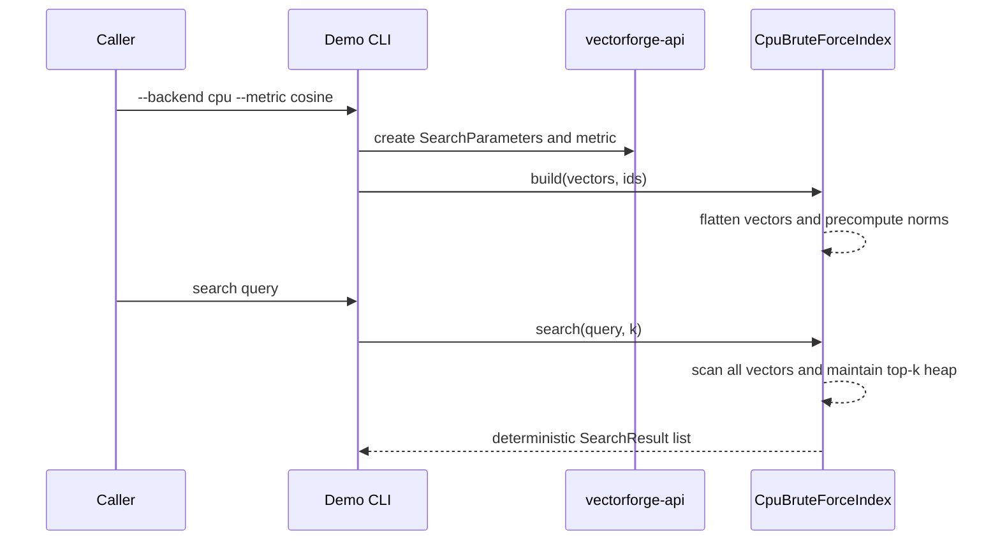

# VectorForge Architecture

## Scope

This repository establishes the API and CPU baseline while reserving clear extension points for native and GPU work. The currently verified implementation path is entirely CPU-backed.

## Module Responsibilities

- `vectorforge-api`: backend-independent contracts, result records, metrics, and parameter validation
- `vectorforge-cpu`: exact brute-force reference implementation used for correctness and current benchmarks
- `vectorforge-demo`: CLI entry point for build-and-search workflows and example usage
- `vectorforge-benchmarks`: JMH harness for isolated search measurements
- `vectorforge-native`: placeholder for JNI handle management and resource ownership
- `vectorforge-gpu`: placeholder for a future custom CUDA backend
- `vectorforge-lucene`: placeholder for later comparative integration

## Current Request Flow

## Java API Layer

`vectorforge-api` defines:

- `VectorIndex` as the backend-independent lifecycle and search contract
- Immutable value objects for results, parameters, and metrics
- `DistanceMetric` as the algorithm-selection enum

The API intentionally keeps search inputs small and explicit so JNI and future off-heap transfers can map onto it cleanly.

## CPU Backend

`vectorforge-cpu` implements `CpuBruteForceIndex`:

- Input vectors are validated and flattened into a contiguous `float[]`
- IDs are stored in a parallel `long[]`
- Vector norms are precomputed once for cosine similarity
- Search uses a bounded heap to maintain only the best `k` results
- Tie-breaking is deterministic: equal scores are ordered by ascending ID
- Searches are safe to run concurrently after a successful build because index state is immutable once published

Operational implications of the current design:

- Build cost is paid once per dataset and is separate from search latency.
- Search latency scales linearly with indexed vector count because the backend is exact brute force.
- The CPU implementation is the baseline used to judge future CUDA and cuVS correctness.

## JNI Boundary

`vectorforge-native` is currently a placeholder. The planned model is:

- Java owns backend selection and public lifecycle
- Native code owns opaque handles and device resources
- Java never exposes raw native pointers to ordinary application code
- Errors must cross the boundary as structured Java exceptions

## Native Resource Ownership

The current CPU baseline keeps all data on the Java heap. The future native ownership model is documented in [native-memory-model.md](native-memory-model.md).

## CUDA Backend

`vectorforge-gpu` is reserved for an educational exact brute-force GPU implementation:

- GPU-resident index vectors
- Reusable device buffers
- Batched queries
- Explicit transfer and kernel timing

This backend is not implemented yet, so all current build, test, demo, and benchmark results are CPU-only.

## cuVS Adapter

The future cuVS integration will be isolated behind a small native adapter layer so:

- Java code is not tightly coupled to a volatile cuVS API surface
- cuVS discovery can be profile-gated
- The CPU-only build continues to work without CUDA or cuVS installed

This adapter is not implemented yet, so cuVS validation is explicitly skipped in current project reporting.

## Error Propagation

Current behavior:

- Invalid build inputs throw `IllegalArgumentException`
- Invalid lifecycle usage throws `IllegalStateException`
- Public API records validate mandatory fields at construction time

Planned native behavior:

- Native precondition failures become Java exceptions
- CUDA and cuVS failures are never swallowed or converted into silent fallbacks

## Thread-Safety Model

`CpuBruteForceIndex` supports:

- Synchronized `build()` and `close()`
- Lock-free concurrent `search()` calls after build through immutable published state

Concurrent close versus in-flight search is not serialized. A search that already captured a published index snapshot may finish successfully while a concurrent close occurs.

## Current Limitations

- There is no approximate index, graph index, or inverted-file structure yet.
- There is no native memory path in the shipped implementation.
- There is no GPU execution path despite the reserved modules and scripts.
- Benchmark coverage currently reflects single-threaded CPU search only.
